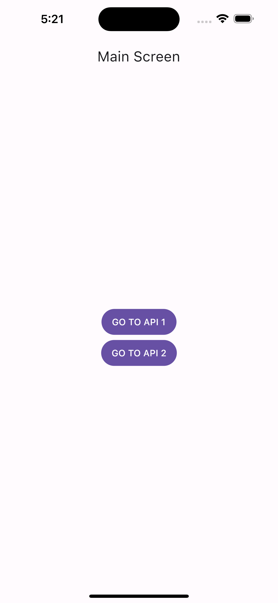
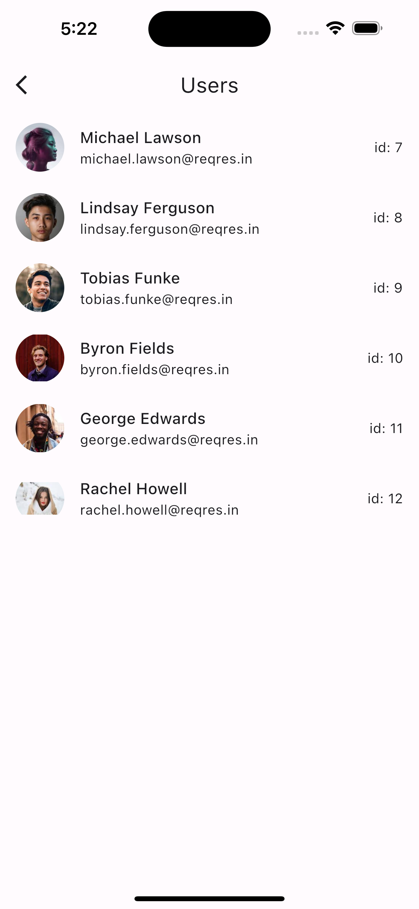
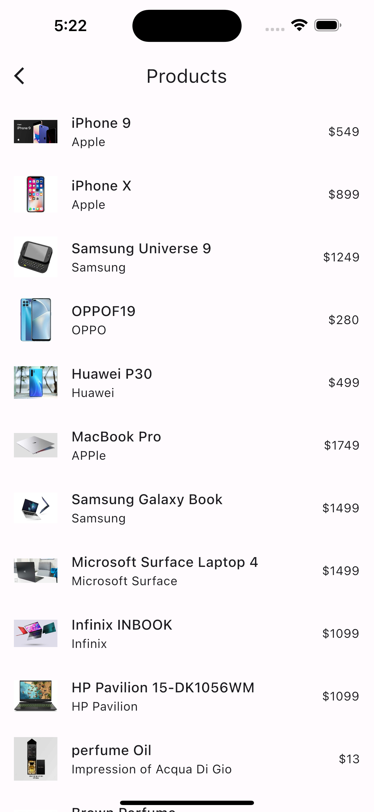
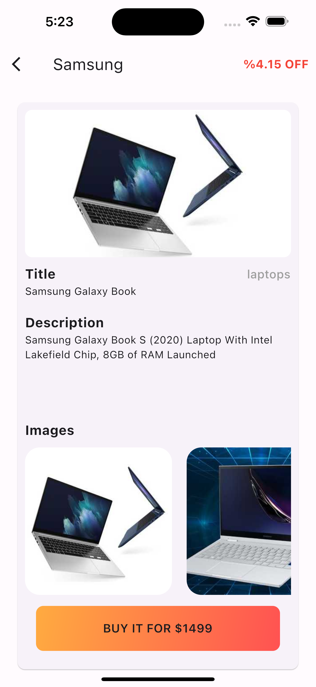

# Random API's

In this repo, I'm fetching API's and showing those on widgets. Actually I don't care UI/UX in this project. I will update it with more API's.

## Screenshots
### Main Screen and First API

| Main Screen       |  First API          |
| ------------- |:-------------:|
|      |  |

### Second Screen

| Second API       |  Second API's Details Page          |
| ------------- |:-------------:|
|      |  |
